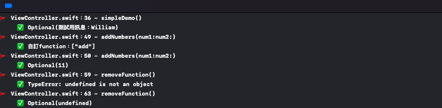

# WWJavaScriptContext

[](https://developer.apple.com/swift/) [](https://developer.apple.com/swift/)  [](https://developer.apple.com/swift/) [](https://developer.apple.com/swift/)

### [Introduction - 簡介](https://swiftpackageindex.com/William-Weng)
- JavaScriptCore Widget.
- JavaScriptCore小工具.



### [Installation with Swift Package Manager](https://medium.com/彼得潘的-swift-ios-app-開發問題解答集/使用-spm-安裝第三方套件-xcode-11-新功能-2c4ffcf85b4b)

```bash
dependencies: [
    .package(url: "https://github.com/William-Weng/WWJavaScriptContext.git", .upToNextMajor(from: "1.0.4"))
]
```

### Function - 可用函式
|函式|功能|
|-|-|
|build(script:)|建立執行完成的環境|
|callFunctionName(_:arguments:)|執行javaScript程式|
|evaluateScript(_:)|執行Script|
|insertNativeFunctionName(_:handler:)|建立Swift-function給js用|
|removeNativeFunctionName(_:)|移除Swift-function|
|createdNativeFuntions()|取得已建立的Swift-Functions|
|exceptionHandler(_:)|回應js控制台錯誤|

### Example
```swift
import UIKit
import WWJavaScriptContext
import WWPrint

final class ViewController: UIViewController {
    
    private var context: WWJavaScriptContext!
    
    override func viewDidLoad() {
        super.viewDidLoad()
        simpleDemo()
        addNumbers(num1: 5, num2: 6)
        removeFunction()
    }
}

private extension ViewController {
    
    func simpleDemo() {
        
        let script = "var jsFunc = function(message) { return '測試用訊息：' + message; }"
        context = WWJavaScriptContext.build(script: script)

        context.exceptionHandler { context, exception in
            if let exception = exception { wwPrint(exception) }
        }
        
        wwPrint(context.callFunctionName("jsFunc", arguments: ["William"]))
    }
    
    func addNumbers(num1: Int, num2: Int) {
        
        let addNumbersHandler: @convention(block) (Int, Int) -> Int = { num1, num2 in return num1 + num2 }
                        
        _ = context.insertNativeFunctionName("add", handler: addNumbersHandler)
        wwPrint("自訂function：\(context.createdNativeFuntions())")
        wwPrint(context.callFunctionName("add", arguments: [num1, num2]))
    }
    
    func removeFunction() {
                
        context.exceptionHandler { context, exception in
            if let exception = exception { wwPrint(exception) }
        }
        
        _ = context.removeNativeFunctionName("add")
        wwPrint(context.callFunctionName("add", arguments: [1, 2]))
    }
}
```
